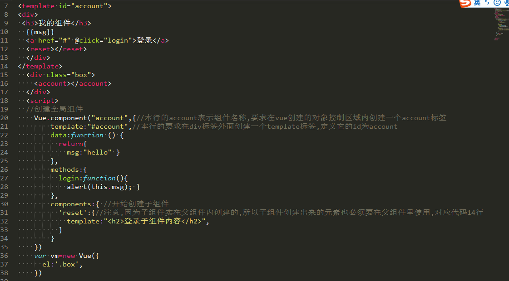

# vue中组件的练习
* ​语法如下
  ```Java
  Vue.component("要创建的标签名称",{
  template:"#id",//因为v2.0有兼容问题,所以template标签内用一个div包裹内部代码
  data:function(){},//这里的data区别与new Vue里的data,这里的是一个方法,并不是对象
  methods:{},//这里的methods与new Vue里的methods使用方式一样
  comonents:{//在这里可以创建子组件
    "要创建的子组件标签名称":{
    template:"<div>张三</div>"//注意,因为子组件是在父组件内创建的,所以要创建的子组件标签要放到父组件的template标签内
    }
  }
  })
  ```
* 举例如下
  
* 父组件传参给子组件:
```Java
 <template id="account">
  <name :tip="msg"></name>
</template>
  <div class="box">
    <login :tip="cname"></login>
    <account></account>
  </div>
  <script>
    var vm=new Vue({
      el:".box",
      data:{
        cname:100,
      },
      components:{
        "login":{
          template:"<div> {{tip}}</div>",
          props:["tip"]//子组件中的props方法用于接收父组件传递过来的参数
        }
      }
    })
  var vm=new Vue({
    el:".box",
  })

  </script>
```
* 子组件传参给父组件
```Java
<template id="sub">
  <button @click="seter">点击发送数据</button>
</template>
  <div class="box">
    <login v-on:send="getdata"></login>
    这里的 v-on:send中的send要对应下面的send,getdata要对应父组件中的getdata方法
  </div>
  <script>
    var vm=new Vue({
      el:".box",
      methods:{
        getdata:function(input){//这里的input用于接收子组件传递过来的值,input可以随意命名
          alert(input)
        }
      },
      components:{
        'login':{
          template:"#sub",
          methods:{
           seter:function () {
             this.$emit("send","hello")//this.$emit方法用于传参数给父元素,第一个参数是一方法,第二个参数是发送的内容
           }
          },
        }
      }
    })
  </script>
```
*获取元素或组件元素(v2.0中只有ref,没有el)
```Java
 <div class="box">
    <button @click="getdata">获取dom对象</button>
    <div ref="mydiv">哈哈</div>
     <button @click="getcom">获取组件对象</button>
   <login ref="mycom"></login>  
  </div>
  <script>
    var vm=new Vue({
      el:".box",
      methods:{
        getdata:function () {
          console.log(this.$refs.mydiv.innerHTML);
        },
        getcom:function(){
          console.log(this.$refs.mycom.subname);//subname要对应下面data方法中的subname
        },
      },
        components:{  //创建一个私有组件
          "login":{
            data:function(){
              return {
                subname:"子组件名称"
              }
            },
            template:"<h1>这是一个子组件</h1>"
          }
        }
    })
  </script>
```
*利用钩子函数创建动画,注意:需要在style标签内给当前添加动画的元素一个样式
```Java
 <style type="text/css">
  .show{
    transition: all 1Zs ease;
  }
 
  </style>
<script  src="vue221.js"></script>
</head>
<body>
<div class="box">
<button @click="toggle">显示动画</button><br>
  <transition 
    @before-enter="beforeEnter" 
      @enter="Enter" 
      @after-enter="afterEnter">
    <div v-show="isshow" class="show"> 你好你好你好</div>
  </transition>  
  </div>
  <script type="text/javascript">
  var vm=new Vue({
    el:".box",
    data:{
        isshow:false,
      },
   methods:{
    toggle:function () {
      this.isshow=!this.isshow;
    },
    beforeEnter:function(el){
      el.style.transform="translate(100px,0)";
    },
    Enter:function(el,done){
      el.offsetWidth;
      el.style.transform="translate(10px,0)";
      done();
    },
    afterEnter:function(el){
       this.isshow=!this.isshow;
    }
   }
  })


  </script>
```


